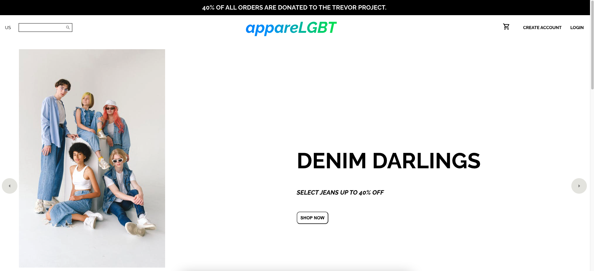

# TEAM 05-Group Project 3: Final Project

# AppareLGBT

## Table of Contents

1. [Description](#description)
2. [Resources](#resources)
3. [Visuals](#visuals)
4. [Author and Aknowledgement](#author-and-aknowledgements)

## User Story

AS a member of the LGBTQ+ community
We WANT an online store that caters to our styles and needs

## Description

AppareLGBT is an online store that caters to the needs and styles of the LGBTQ+ community in a sustainable way that is outside the traditional performative corporate Pride.

## Resources

* [Live Site](https://dry-brook-40661.herokuapp.com/)

* [Repository](https://github.com/Bureizu742/apparelgbt)

## Visuals

## Authors and Acknowledgements

Code created & optimized by UNCC Coding Bootcamp Students - Connor Thompson, Charles Young, Lillian (Patrick) Long, and Jala Unterreiner